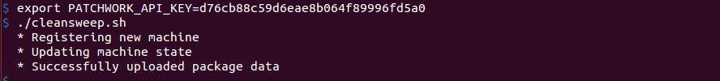

# cleansweep

**Need an API key?** Sign up for one on our [website](https://patchworksecurity.com)



Get notifications when packages are outdated. Register your installed packages with us and we will contact you as new security updates are released. No need to follow mailing lists or filtering RSS feeds for relevant packages.

### Usage

This server requires a Patchwork API key.

_**Note:**_ Replace **your_api_key** with the key you received from sign up

Set your **PATCHWORK_API_KEY** with either

```sh
$ export PATCHWORK_API_KEY=your_api_key
$ ./cleansweep.sh
```

or


```sh
$ PATCHWORK_API_KEY=your_api_key ./cleansweep.sh
```


### Examples


```sh
# Register a machine
./cleansweep.sh

# Register with machine name `testing`
FRIENDLY_NAME=testing ./cleansweep.sh

# Store / load configuration from `.config` directory
CONFIG_DIR=.config ./cleansweep.sh

# Specify a UUID to use
CLEANSWEEP_UUID=95ff6009-3782-4d13-9968-4f7e8778ab93 ./cleansweep.sh

# Enable verbose output
# This outputs all your installed packages to the console
./cleansweep.sh -v
```

### Options

#### `-v`

Enable verbose output to stderr

### Environment variables

- `PATCHWORK_API_KEY`: The API key to use
- `FRIENDLY_NAME`: Specify a custom name for this machine, `hostname` by default
- `CONFIG_DIR`: Specify an alternative location to store metadata, `.patchwork` by default
- `CLEANSWEEP_UUID`: Specify a UUID to use. The UUID must have been obtained through a previous register call.


### Configuration

The machine uuid is stored in `.patchwork/uuid` by default. You can reset the uuid by deleting that file. This may be required when upgradng the operating system.

You can specify a UUID by setting `CLEANSWEEP_UUID`. UUIDs are specific to Linux versions. You will need a new UUID if you upgrade your version of Linux, e.g. Ubuntu 12.04 to Ubuntu 14.04

## License

MIT © Patchwork Security, Inc.
